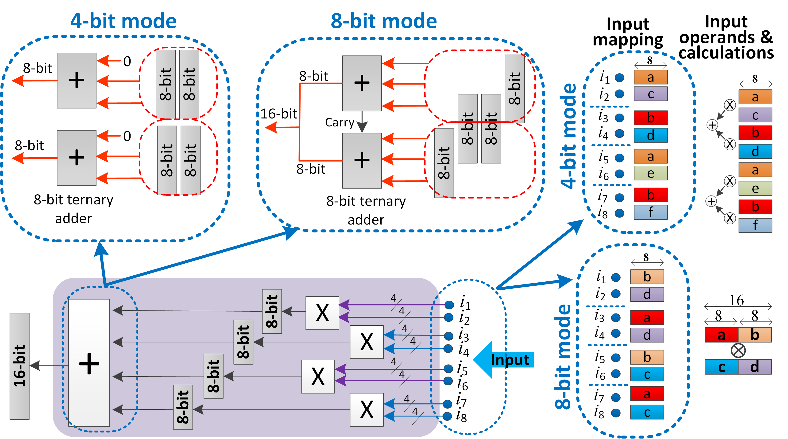

# MpDNN-Accelerator

N. Neda, S. Ullah, A. Ghanbari, A. Kumar, M. Modarressi and H. Mahdiani, "MpDNN: MultiPrecision Deep Neural Network Acceleration on FPGAs", In preparation, University of Tehran, Iran & Technische Universitt Dresden, Germany

# Abstract

Quantization is a promising approach to reduce the computational load of neural networks. The minimum bit-width that preserves the original accuracy varies significantly across different neural networks and even across different layers of a single neural network. Most existing designs overprovision accelerators with sufficient bit-width to preserve the required accuracy across a wide range of neural networks. In this research, we present MpDNN, a multi-precision deep neural network accelerator with dynamically adjustable bit-width. The design supports run-time splitting an arithmetic operator into multiple independent operators with smaller bit-width, effectively increasing throughput when lower precision is required. The proposed architecture is designed for FPGAs, in that the multipliers and bit-width adjustment mechanism are optimized for the LUTbased structure of FPGAs. Experimental results show that by enabling run-time precision adjustment mpDNN can offer 3-15x improvement in throughput.

## MULTIPRECISION MULTIPLIER DESIGN
We use an n×n-bit multiplier as the base of our fusible
design and show how the baseline multipliers can be fused
recursively to build 2n-bit, 4n-bit, and wider multipliers.
Since mpDNN targets FPGAs, the baseline multiplier and the
fusion scheme are designed after FPGAs’ specific LUT-based
architecture. Fig. 1 displays the fusion scheme. It shows how the four 4-bit
multipliers (or Mult4 for short) are used to implement either
four 4-bit multiplications or a single 8-bit multiplication

<figcaption>Fig. 1. - The structure of the multiplier in the 4-bit and 8-bit
configurations.</figcaption>

###### Adder Architecture
In order for the adder to sum either four partial products to generate a 16-bit result or two pairs of 8-bit partial products to generate two 8-bit results, the adder is divided into two parallel 8-bit units; in the 4-bit mode, they are entirely independent, but in the 8-bit mode, they form a unified 16-bit
adder, with a carry signal propagated between the units. We used the ternary adder design presented in [1] which is designed with 6-input LUTs and carry chain. Fig. 2. shows the inputs of each ternary adder in 4 and 8 bit mode of execution. Note that as we need to get two outputs from the LUTs (the Sum bit and LUT-based carry), the internal structure
of the LUTs necessitate always setting one of the six inputs to one.Since we require a control signal to show the execution mode, there would only be four inputs left to implement the required logic. As Fig. 4 shows, the four least significant bits of the TA1 and
the four most significant bits of TA2 require two more signals; therefore, we require a multiplexer to select the input of the terney adder in these positions. Fig.4. shows how the result of the four 4-bit multipliers are mapped onto the multiplexers and adders. The multiplexer is also implemeted by LUT.

<figcaption>Fig. 2. - Partial product summation in the 8-bit and 4-bit
modes.</figcaption>

<figcaption>Fig. 3. - Mapping the inputs onto the multiplexer and ternary
adder LUTs.</figcaption>

###### Adder Architecture
The accelerator's building block is a 16-bit multiply-and-accumulate (MAC) unit made by the 16-bit mpDNN multiplier. The baseline multiplier of this 16-bit MAC unit is an approximate 4-bit multiplier[2] which utilizes 6-input LUTs and the associated carry chain. This approximate multiplier eliminated the carry propagation to reduce the latency, but the input carry is predicted by incorporating some input bits of the previous bit positions in each bit position's calculations. The 16-bit multiplier is made by 16 baseline multipliers, which can be fused recursively to build four 8-bit multipliers or one 16-bit multiplier.

[1]Kumm, M. and Zipf, P., 2014, March. Efficient High Speed Compression Trees on Xilinx FPGAs. In MBMV (pp. 171-182).
[2]Ullah, S., Rehman, S., Prabakaran, B.S., Kriebel, F., Hanif, M.A., Shafique, M. and Kumar, A., 2018, June. Area-optimized low-latency approximate multipliers for FPGA-based hardware accelerators. In Proceedings of the 55th Annual Design Automation Conference (pp. 1-6).
[3]Sharma, H., Park, J., Suda, N., Lai, L., Chau, B., Chandra, V. and Esmaeilzadeh, H., 2018, June. Bit fusion: Bit-level dynamically composable architecture for accelerating deep neural network. In 2018 ACM/IEEE 45th Annual International Symposium on Computer Architecture (ISCA) (pp. 764-775). IEEE.
